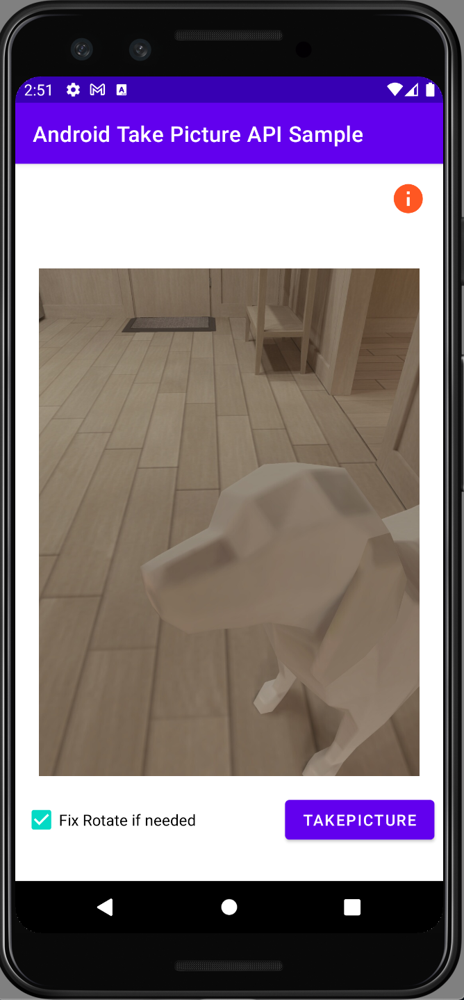
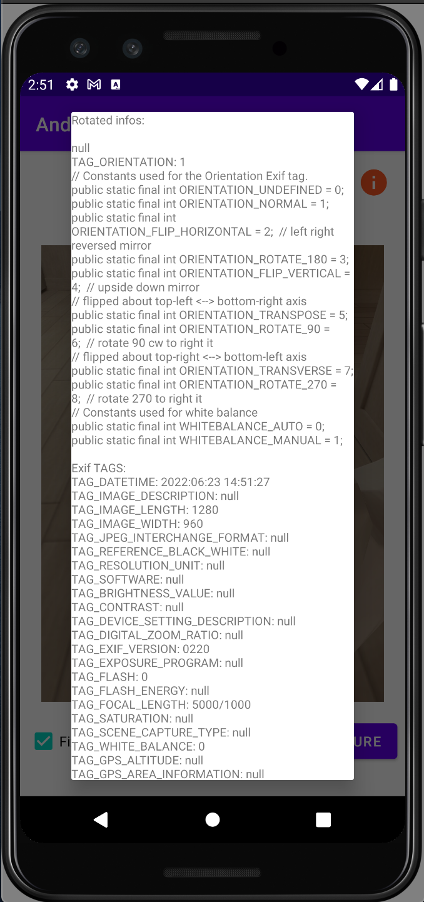

# TakePicktureAPIAndroidSample
## An Android App of how to use ActivityResultContracts.TakePicture() API to get a picture from the native camera app

* Kotlin
* ActivityResultContracts.TakePicture() API
* android.media.ExifInterface

* Step:
* Open the app
* Marke the checkBox Fix Rotate...
* Click on TAKEPICTURE
* Take a picture from the native camera
* Check if the picture is shown on the activity rotated correctly
* Click on "i" icon to see the ExifInterface TAGS informations

### Reference
* https://medium.com/codex/how-to-use-the-android-activity-result-api-for-selecting-and-taking-images-5dbcc3e6324b
* https://www.geeksforgeeks.org/what-is-exifinterface-in-android/
* https://developer.android.com/reference/androidx/exifinterface/media/ExifInterface
